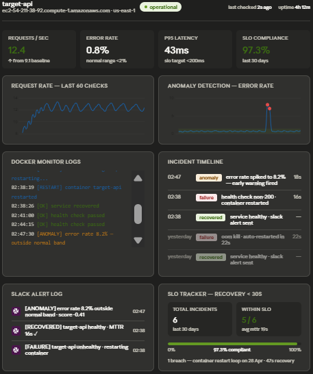

# 🛰️ SRE Monitor — Self-Healing Infrastructure with ML Anomaly Detection

[](https://www.python.org/)
[](https://fastapi.tiangolo.com/)
[](https://www.docker.com/)
[](https://aws.amazon.com/ec2/)
[](https://www.terraform.io/)
[](https://prometheus.io/)
[](https://scikit-learn.org/)
[](https://github.com/features/actions)
[](https://www.nginx.com/)

A production-style monitoring stack that detects, diagnoses, and recovers from service failures **without human intervention**. A Python agent polls a FastAPI target every 5 seconds, restarts crashed containers via the Docker SDK, and runs a parallel Isolation Forest scorer over Prometheus metrics to flag probabilistic degradation *before* the health-check ever trips. Everything ships to AWS EC2 via Terraform and redeploys on every push to `main` through GitHub Actions.

---

## 🏗️ Architecture

```
                                ┌─────────────────────────────────────────────────┐
                                │                  AWS EC2 (t3.micro)             │
                                │                                                 │
   Browser ──── :80 ────────────┼──▶ ┌──────────┐                                  │
                                │    │  nginx   │  serves dashboard +             │
                                │    │ (static) │  proxies /api/* → target-api    │
                                │    └────┬─────┘                                 │
                                │         │                                       │
                                │         ▼                                       │
                                │    ┌──────────────┐  /health,/api/status        │
                                │    │  target-api  │◀─────────┐                  │
                                │    │  (FastAPI)   │          │                  │
                                │    │  + /chaos    │          │ 5s health probe  │
                                │    └──────┬───────┘          │ 1s anomaly probe │
                                │           │ /metrics         │                  │
                                │           ▼                  │                  │
                                │    ┌──────────────┐          │                  │
                                │    │  Prometheus  │◀─────────┤ PromQL queries   │
                                │    │  (5s scrape) │          │ rps, p95         │
                                │    └──────────────┘          │                  │
                                │                              │                  │
                                │    ┌─────────────────────────┴──────────────┐   │
                                │    │            monitor agent               │   │
                                │    │  ┌──────────────┐  ┌────────────────┐  │   │
                                │    │  │ health loop  │  │ Isolation      │  │   │
                                │    │  │ (5s)         │  │ Forest scorer  │  │   │
                                │    │  │ 3-fail → 🔁  │  │ (per metric)   │  │   │
                                │    │  └──────┬───────┘  └────────┬───────┘  │   │
                                │    └─────────┼───────────────────┼──────────┘   │
                                │              │                   │              │
                                │              ▼                   ▼              │
                                │    ┌──────────────┐      ┌──────────────┐       │
                                │    │  Docker SDK  │      │  Slack       │       │
                                │    │  restart()   │      │  Webhook 📣  │──────►│ Slack
                                │    └──────────────┘      └──────────────┘       │
                                │                                                 │
                                │    incidents.db (SQLite, shared volume)         │
                                └─────────────────────────────────────────────────┘
                                                  ▲
                                                  │ git push main
                                       ┌──────────┴──────────┐
                                       │  GitHub Actions     │
                                       │  scp + compose up   │
                                       └─────────────────────┘
```

Five containers run side by side under `docker compose`: **target-api**, **monitor**, **dashboard** (nginx), **prometheus**, and **grafana**. The `monitor` and `target-api` containers share a SQLite volume so the dashboard can read incident history written by the agent.

---

## 🧰 Tech Stack

| Layer            | Tool                                   | Why                                                       |
| ---------------- | -------------------------------------- | --------------------------------------------------------- |
| Service runtime  | Python 3.11 · FastAPI · Uvicorn        | Instrumented health endpoint with `/chaos` failure injection |
| Agent            | Python · Docker SDK · `requests`       | Polls health, restarts containers in-process              |
| ML detection     | scikit-learn (Isolation Forest) · NumPy| Per-metric outlier models trained on real baseline traffic|
| Metrics          | Prometheus · `prometheus-fastapi-instrumentator` | 5s scrape, 15s rate windows                     |
| Visualization    | Vanilla JS + Chart.js · nginx          | Custom ops dashboard, no framework overhead               |
| Secondary viz    | Grafana                                | Kept as a fallback / classic SRE view                     |
| Storage          | SQLite                                 | Shared volume between agent and API for incident history  |
| Orchestration    | Docker Compose                         | One-file local + remote topology                          |
| Infrastructure   | Terraform · AWS EC2 (Amazon Linux 2)   | `terraform apply` rebuilds the host from scratch          |
| CI/CD            | GitHub Actions · `scp-action` · `ssh-action` | Push-to-deploy on `main`                            |
| Alerting         | Slack Incoming Webhooks                | Reactive *and* proactive alert paths                      |

---

## ⚙️ How It Works

### 1. Self-Healing Loop

The monitor agent ([monitor/monitor.py](monitor/monitor.py)) hits `target-api:8000/health` every 5 seconds. After **3 consecutive failures** it:

1. Opens an incident row in `incidents.db`.
2. Calls `client.containers.get(...).restart()` via the Docker SDK.
3. Posts a `🚨 FAILURE DETECTED` message to Slack.
4. Arms a **5-second post-restart grace window** so the booting container's connection refusals don't poison the next decision cycle or refill the anomaly probe window.
5. On the next successful probe, closes the incident with a measured `duration_seconds` and posts `✅ RECOVERED`.

End-to-end recovery — detection → restart → first healthy probe — typically lands inside **~30 seconds**.

### 2. ML Anomaly Detection

A separate 1-second probe thread feeds an in-process rolling error-rate window, while the main loop pulls `rps` and `p95_latency` from Prometheus. These three signals are fed into **three independent Isolation Forest models**, one per metric ([monitor/anomaly_detector.py](monitor/anomaly_detector.py)).

Why three models instead of one 3-D model? A single multi-feature IF dilutes single-axis anomalies — only ~1/n of split decisions land on any given axis, so a 100% error-rate spike with normal rps/latency may not be flagged. Per-metric IFs give each axis full detection power.

The detector is trained on a real **20-minute baseline** captured by [collect_baseline.py](collect_baseline.py), which samples Prometheus every 5s and writes [baseline.csv](baseline.csv). Contamination is tuned per signal:

| Metric       | Contamination | Reason                                                     |
| ------------ | ------------- | ---------------------------------------------------------- |
| `rps`        | 0.05          | Needs slack so legit low-traffic moments stay in-distribution |
| `error_rate` | 0.05          | Degenerate baseline (mostly zero) — gets noise injected at fit time |
| `latency`    | 0.01          | Naturally jittery; strict threshold avoids false positives |

When any model fires, the agent attributes the dominant deviation in σ-units (`error_rate (4.2σ from baseline)`), buckets the trigger, and posts a `⚠️ ANOMALY DETECTED` message — gated by a 60-second per-trigger cooldown so a single sustained event doesn't spam the channel.

### 3. Observability Dashboard

A vanilla-JS, dark-themed ops dashboard ([dashboard/index.html](dashboard/index.html)) served by nginx polls `/api/status` and renders:

- 🟢 Live status pill (`ok` / `degrading` / `unhealthy`) derived from the real-time 5xx rate
- 📈 Three time-series charts: RPS, error rate, p95 latency — all overlaid with the **baseline ±σ band** so you can see the model's normal range
- 🔴 Anomaly score chart with red markers at every fired event
- 📋 Incident feed with resolved/unresolved state and duration
- 💬 Slack alert log (every message the agent sent, mirrored from SQLite)



Grafana is wired into the stack as a secondary view (port `:3000`) for ad-hoc PromQL exploration, but the primary operator surface is the custom dashboard above.

---

## 📡 Monitoring Architecture — Two Alert Paths in Parallel

| Path           | Cadence | Source             | Trigger                          | Action                          |
| -------------- | ------- | ------------------ | -------------------------------- | ------------------------------- |
| **Reactive**   | 5s      | `/health` HTTP probe | 3 consecutive failures         | 🔁 restart container + Slack 🚨 |
| **Proactive**  | 1s probe + 5s scoring | Prometheus rps/latency + in-process error-rate window | Any per-metric Isolation Forest fires | Slack ⚠️ (no auto-action)     |

The reactive path is the *circuit breaker* — it only acts on confirmed, sustained failure. The proactive path is the *early warning* — a 25% error rate that the slow probe might statistically miss is caught by the high-frequency probe within seconds, and the IF flags it as out-of-distribution before it ever crosses the 3-failure restart threshold.

---

## 🧪 Local Setup

Prerequisites: Docker, Docker Compose, an optional Slack webhook URL.

```bash
# 1. (optional) Slack alerts
echo "SLACK_WEBHOOK=https://hooks.slack.com/services/..." > .env

# 2. Bring up the full stack
docker compose up --build
```

Services:

| Service       | URL                       |
| ------------- | ------------------------- |
| Dashboard     | http://localhost          |
| target-api    | http://localhost:8000     |
| Prometheus    | http://localhost:9090     |
| Grafana       | http://localhost:3000     |

Trigger a failure to watch the loop run:

```bash
# Probabilistic degradation that ramps to 100% over ~8 seconds
curl -X POST http://localhost:8000/chaos

# Instant recovery (skips the auto-restart path)
curl -X POST http://localhost:8000/recover

# Wipe history, keep the trained baseline
curl -X POST http://localhost:8000/reset
```

---

## ☁️ Cloud Deploy

### 1. Provision EC2 with Terraform

```bash
terraform init
terraform apply
# → outputs the public IP of the instance
```

[main.tf](main.tf) provisions a `t3.micro` running Amazon Linux 2, installs Docker + Compose via `user_data`, and opens 22 / 80 / 8000 / 9090 / 3000.

### 2. Configure GitHub Secrets

| Secret           | Value                                  |
| ---------------- | -------------------------------------- |
| `EC2_HOST`       | The public IP from `terraform output`  |
| `EC2_SSH_KEY`    | Private key matching the uploaded pub key |
| `SLACK_WEBHOOK`  | Your Slack incoming-webhook URL        |

### 3. Push to `main`

[.github/workflows/deploy.yml](.github/workflows/deploy.yml) waits for SSH to be ready, `scp`s the repo to `~/sre-project`, writes `.env`, and runs `docker compose up -d --build`. From `git push` to a healthy stack on EC2 is roughly two minutes.

A full **`terraform destroy && terraform apply`** rebuilds the entire environment from scratch — the only piece of stateful data that needs to survive is [baseline.csv](baseline.csv), which is committed to the repo so the trained detector is identical on every fresh box.

---

## 🧠 Design Decisions Worth Calling Out

- **Three 1-D Isolation Forests instead of one 3-D model.** A combined model gave noticeably worse single-axis recall during testing — a clean error-rate spike with normal traffic and latency would slip through. Splitting by metric also makes attribution trivial: whichever model fires *is* the cause.
- **An in-process probe deque alongside Prometheus.** Prometheus counters reset when the target container restarts and its rate window has a 15s lag. The agent keeps its own 30s rolling window of probe outcomes so error-rate is immediate, survives restarts, and isn't fooled by counter resets.
- **A unified 5s grace gate after every restart and on cold start.** Without it, the freshly-booted container's connection refusals would refill the probe window, spike latency from boot artifacts, and immediately re-fire the anomaly detector. One shared grace timer fixes both the false-positive and the restart-loop failure modes.
- **SQLite over a shared volume instead of a separate datastore.** The agent and the API are both single-replica and run on the same box; a real DB would have been infrastructure for infrastructure's sake. If the design ever needed horizontal scaling, this is the first thing that would change.
